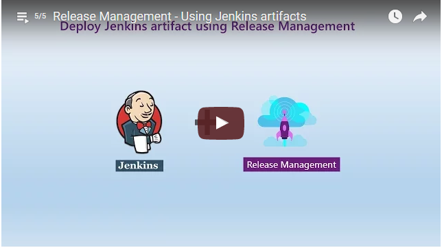

# Visual Studio Team Services Continuous Deployment

This plugin lets you trigger a release in Visual Studio Team Services, through a post-build step in Jenkins.

### Overview
Once you have configured Continuous Integration (CI) with Jenkins to be able to build with every code checkin/commit, the next step toward automating your DevOps pipeline is to be able to deploy automatically by setting up the Continuous Deployment (CD) pipeline.

[VS Team Service Release Management](https://www.visualstudio.com/features/release-management-vs) service lets you automate your deployments so that you could deliver your apps/services easily and deliver them often. You can setup the CI and CD process all on VS Team Services. However, if you have the CI pipleine already set with Jenkins, VS Team Service has good integration points through its [APIs](https://www.visualstudio.com/integrate/api/overview#Releasepreview) that can let you interact with its release service from any other third-party - Jenkins in this case.

This plugin makes use these APIs that lets you trigger a release in VS Team Services or TFS, upon completion of a build in Jenkins. The plugin has a post build step - "VS Team Services Continuous Deployment".

### Install the "VS Team Services Continuous Deployment" plugin 

Just like any other plugin installation, go to **Manage Jenkins** -> **Manage plugins**. Search for the plugin named "VS Team Services Continuous Deployment"  and install it.

### Using the plugin

Assuming that you have already [created the Release Definition](https://www.visualstudio.com/en-us/docs/release/author-release-definition/more-release-definition) and [linked the Jenkins as artifact source](https://www.visualstudio.com/en-us/docs/release/author-release-definition/understanding-artifacts#jenkins) in Vs Team Service - Release Manaegment, you need to follow the following steps at the Jenkins side to trigger releases automatically, upon build creation.

** 0. Setup Release Definition with Jenkins as artifact source**
This document assumes that you have already set up the RM definition that uses Jenkins artifact to deploy. This means your build/job is configured properly and archives artifacts. If not, see the following video to set up Release Definition with Jenkins build

**1. Add the post build action**
Go to your 

**2. Fill in the required fields**
3. All set. See CD in action

